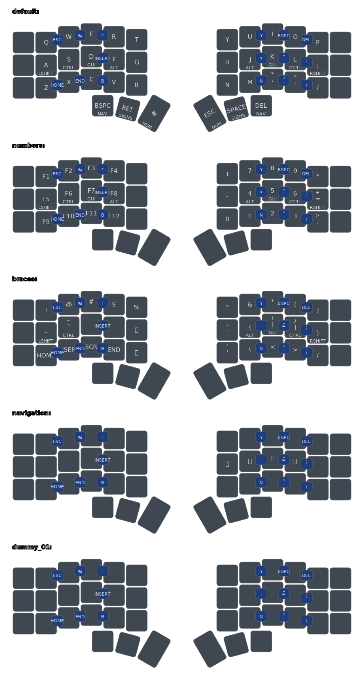

## ZMK CORNE 36 LED

#### Features:

* Combo Keys for Backspace/ESC/...
* [Urob's awesome homerow mods!!!](https://github.com/urob/zmk-config)
* [Keymap image generator helper and workflow](https://github.com/caksoylar/keymap-drawer?tab=readme-ov-file)

#### Missing Features:

* LED Layer Indicators
* BT Shortcuts
* Mouse Actions
* Intelligent Number Layer
* Intelligent CAPS_WORD

#### Keyboard Layout:

/*#  <image x="0"   y="0"  width="100%" height="100%" href="./keymap/background.jpg" />a*/
<svg width="975" height="411" viewBox="0 0 975 411" class="keymap" xmlns="http://www.w3.org/2000/svg" xmlns:xlink="http://www.w3.org/1999/xlink">

<g>
  <image x="0"   y="20" width="100%" height="100%" href="./keymap/fancy/corne_default.svg" />
  <image x="20"  y="0"  width="100%" height="100%" href="./keymap/fancy/corne_braces.svg" />
  <image x="-18" y="0"  width="100%" height="100%" href="./keymap/fancy/corne_numbers.svg" />
  <image x="-18" y="40" width="100%" height="100%" href="./keymap/fancy/corne_navigation.svg" />
</g>
</svg>

