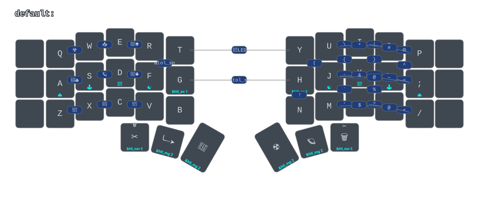
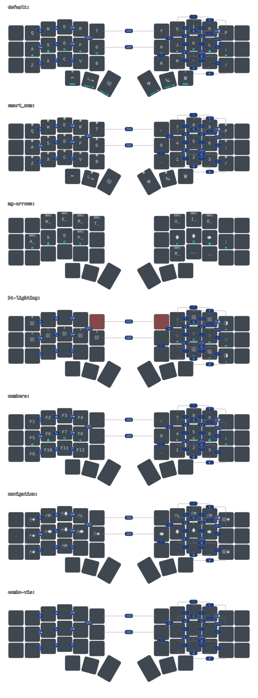

## ZMK CORNE 36 LED CONFIG

<svg width="975" height="411" viewBox="0 0 975 411" class="keymap">
  <image x="0"   y="20" width="100%" height="100%" href="./keymap/fancy/corne_default.svg" />
  <!--image x="20"  y="0"  width="100%" height="100%" href="./keymap/fancy/corne_signs.svg" /-->
  <image x="-18" y="0"  width="100%" height="100%" href="./keymap/fancy/corne_numbers.svg" />
  <!--image x="-18" y="40" width="100%" height="100%" href="./keymap/fancy/corne_navigation.svg" /-->
</svg>

#### Features:

* [x] Smart-Numbers layer
* [x] LED-color layer indicators
* [x] Layered combo keys (see keymaps)
* [x] [Urob's timerless homerow mods](https://github.com/urob/zmk-config)
* [x] Multigram Layer Punctuation:
  |Key          |       OUTPUT | Stickyshift |
  |-------------| ------------:|:-----------:|
  |`,`          |  `,`+`SPACE` |          ⛔ |
  |`.`          |  `.`+`SPACE` |          ✅ |

* [ ] Multigram Layer Alphas:
  - On `SHIFT` the initial character is Caps
  - On `TABDANCE` a `SPACE` is appended
  - On `TABDANCE+SHIFT` the initial character is Caps and a `SPACE` is appended

* [x] Vocals:
  | Key |  [Raw - Ctrl - GUI - CTRL+GUI] | ALT + [Raw - Ctrl - GUI - CTRL+GUI] |
  |:---:| ------------------------------:|:----------------------------------- |
  | `a` |       `at` - `are - ave - ang` | `and - ack - ath` - `ation`         |
  | `e` |       `er` - `ere - eve - eng` | `end - eck - eth` - `ever`          |
  | `o` |       `or` - `ore - ove - ong` | `ond - ock - oth` - `ought`         |
  | `i` |       `in` - `ire - ive - ing` | `ind - ick - ith` - `ight`          |
  | `u` |       `un` - `ure - uve - ung` | `und - uck - uth` - `urg`           |

* [ ] Consonants:
  | Key |  [Raw - Ctrl - GUI - CTRL+GUI] | ALT + [Raw - Ctrl - GUI - CTRL+GUI] |
  |:---:| ------------------------------:|:----------------------------------- |
  | `f` |        `for` - `ft - fr - ___` | `from - ___ - ___` - `___`          |
  | `m` |      `ment` - `me - my - must` | `many - much - more` - `most`       |
  | `t` |       `th` - `the - ter - tor` | `that - this - they` - `tion`       |
  | `w` |   `wh` - `would - will - with` | `which - way - when` - `want`       |

* [x] Keymap image generator helpers and actions
  - [x] [Keymap image generator](https://github.com/caksoylar/keymap-drawer?tab=readme-ov-file)
  - [x] Playful GitHub actions addition of `shellcheck` with auto comments on issues
  - [ ] (Dirty) fix PR/Push race-conditions
  - [ ] (Dirty) customized symbols
  - [ ] (Dirty) custom Script to create layer overlays
  - [ ] (Dirty) custom Github workflow for auto updates

#### Features That'll Need Some Work:

* [x] LED layer indicators
* [ ] BT Shortcuts
* [ ] LED Shortcuts
* [ ] Mouse Actions
* [x] Intelligent CAPS WORD
* [x] Intelligent Number Layer

#### Cleanups/Optimizations:

* [x] Clean up defines
* [ ] Clean up overlay script
* [x] Clean up config (includes)
* [ ] Optimize numbers layer trigger
* [x] Optimize combo timings
* [x] Optimize hold-tap/combo/... timings

#### Keyboard Layout:

