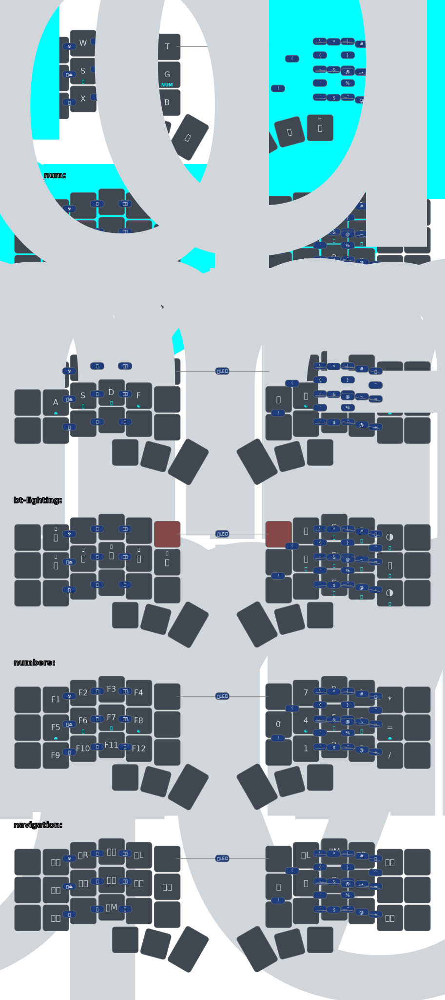

## ZMK CORNE 36 LED CONFIG

<svg width="975" height="411" viewBox="0 0 975 411" class="keymap" xmlns="http://www.w3.org/2000/svg" xmlns:xlink="http://www.w3.org/1999/xlink">
<g>
  <image x="0"   y="20" width="100%" height="100%" href="./keymap/fancy/corne_default.svg" />
  <image x="20"  y="0"  width="100%" height="100%" href="./keymap/fancy/corne_signs.svg" />
  <image x="-18" y="0"  width="100%" height="100%" href="./keymap/fancy/corne_numbers.svg" />
  <image x="-18" y="40" width="100%" height="100%" href="./keymap/fancy/corne_navigation.svg" />
</g>
</svg>

#### Features:

* [x] LED-color layer indicators
* [x] Couple of combo keys (see keymaps)
* [x] [Urob's timerless homerow mods](https://github.com/urob/zmk-config)
* [ ] Multigram Layer Punctuation:
  |Key          |       OUTPUT | Stickyshift |
  |-------------| ------------:|:-----------:|
  |`,`          |  `,`+`SPACE` |          ⛔ |
  |`.`          |  `.`+`SPACE` |          ✅ |
  |`Q`          |  `!`+`SPACE` |          ✅ |
  |`/`          |  `?`+`SPACE` |          ✅ |

* [ ] Multigram Layer Vocals:
  - On `ALT` a `SPACE` is appended
  - On `SHIFT` the initial character is Caps
  - On `ALT+SHIFT` the initial character is Caps and a `SPACE` is appended
  | Key           | Raw  | Ctrl | GUI | CTRL+GUI     |
  | ------------- |-----:|-----:| ---:| ------------:|
  | `a`           |   at |  are | ave |          ang |
  | `e`           |   er |  ere | eve |          eng |
  | `o`           |   or |  ore | ove |          ong |
  | `i`           |   in |  ire | ive |          ing |
  | `u`           |   un |  ure | uve |          ung |

* [x] Keymap image generator helpers and actions
  - [x] [Keymap image generator](https://github.com/caksoylar/keymap-drawer?tab=readme-ov-file)
  - [x] Playful GitHub actions addition of `shellcheck` with auto comments on issues
  - [ ] (Dirty) customized symbols
  - [ ] (Dirty) custom Script to create layer overlays
  - [ ] (Dirty) custom Github workflow for auto updates

#### Features That'll Need Some Work:

* [ ] LED layer indicators
* [ ] BT Shortcuts
* [ ] LED Shortcuts
* [ ] Mouse Actions
* [ ] Intelligent CAPS WORD
* [ ] Intelligent Number Layer

#### Cleanups/Optimizations:

* [ ] Clean up defines
* [ ] Clean up overlay script
* [x] Clean up config (includes)
* [ ] Optimize numbers layer trigger
* [x] Optimize combo timings
* [x] Optimize hold-tap/combo/... timings

#### Keyboard Layout:

